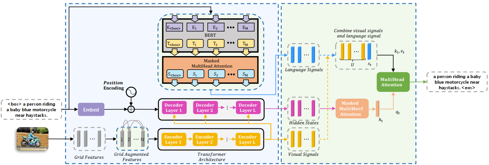
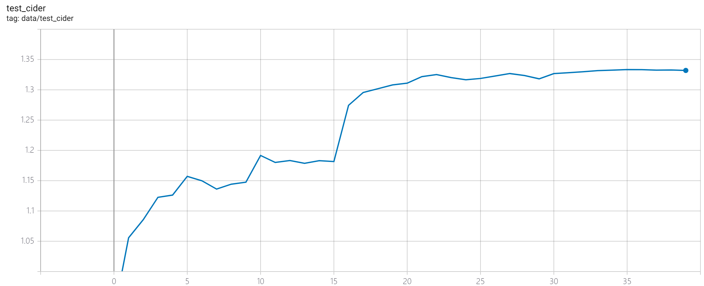
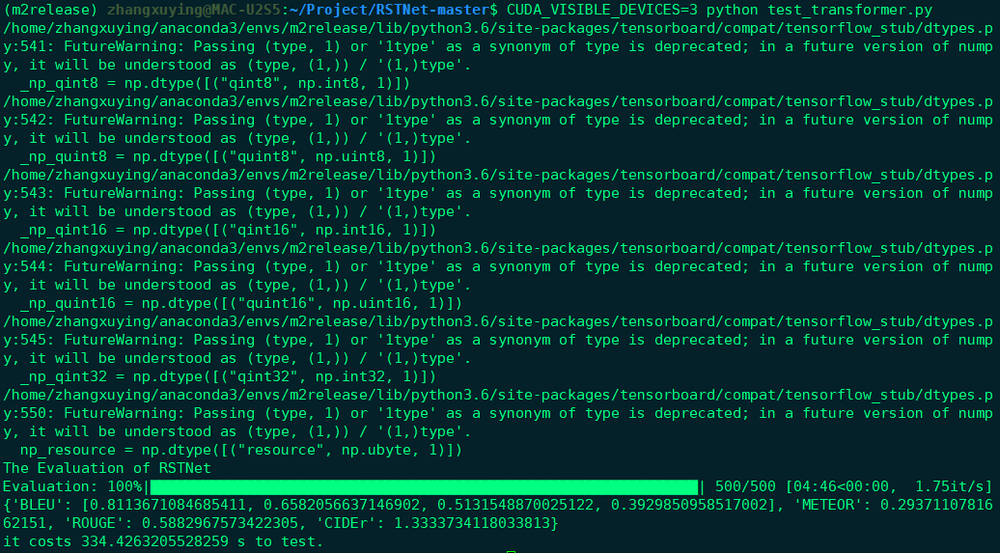

# RSTNet: Relationship-Sensitive Transformer Network
This repository contains the reference code for our paper [_RSTNet: Captioning with Adaptive Attention on Visual and Non-Visual Words_ (CVPR 2021)](https://openaccess.thecvf.com/content/CVPR2021/papers/Zhang_RSTNet_Captioning_With_Adaptive_Attention_on_Visual_and_Non-Visual_Words_CVPR_2021_paper.pdf).

<p align="center">
  
</p>

## Tips
If you have any questions about our work, feel free to post issues on this github project. I will answer your questions and update code monthly.  
If you are in hurry, please email me via [zhangxuying1004@gmail.com](zhangxuying1004@gmail.com).   
If our work is helpful to you or gives some inspiration to you, please star this project and cite our paper. Thank you!  
```
@inproceedings{zhang2021rstnet,
  title={RSTNet: Captioning with adaptive attention on visual and non-visual words},
  author={Zhang, Xuying and Sun, Xiaoshuai and Luo, Yunpeng and Ji, Jiayi and Zhou, Yiyi and Wu, Yongjian and Huang, Feiyue and Ji, Rongrong},
  booktitle={Proceedings of the IEEE/CVF conference on computer vision and pattern recognition},
  pages={15465--15474},
  year={2021}
}
```

## Environment setup
Clone the repository and create the `m2release` conda environment using the `environment.yml` file:
```
conda env create -f environment.yml
conda activate m2release
```

Then, download spacy data by executing the following command:   
```python -m spacy download en``` or ```python -m spacy download en_core_web_sm```.

You also need to create 5 new folders, namely ```Datasets```, ```save_language_models```, ```language_tensorboard_logs```,  ```save_transformer_models``` and ```transformer_tensorboard_logs``` in the root directory of this project.

## Data preparation
To run our code, you need to put annotations folder ```m2_annotations```, visual features folder ```X101-features``` for the COCO dataset into ```Datasets```.  

Most annotations have been prepared by [1], please download [m2_annotations](https://drive.google.com/drive/folders/1tJnetunBkQ4Y5A3pq2P53yeJuGa4lX9e?usp=sharing) and put it into this root directory.  

Visual features are computed with the code provided by [2]. To reproduce our result, please download the COCO features file such as ```X-101-features.tgz``` in [grid-feats-vqa
](https://github.com/facebookresearch/grid-feats-vqa) and rename the extracted folder as ```X101-features```. Considering that this feature file is huge, you can alternatively save the features as float16 for storage space saving by executing the following command:
```
python switch_datatype.py
```
In order to solve the shape difference and match the feat shape with region feat shape (`50` regions), please execute the following command to reshape the visual to `49(7x7)` and save all visual features as a h5py file.
```
python feats_process.py
```
Note that you can also access to my processed offline image features [coco_grid_feats](https://pan.baidu.com/s/1myelTYJE8a1HDZHkoccfIA) in Baidu Netdisk with the extraction code ```cvpr``` for convenience.  

<!-- Note that, you can also use my processed offline image features [X101_grid_feats_coco_trainval.hdf5](https://pan.xunlei.com/s/VMyFV3OcrpOj7TdWkt5_amwiA1) with extraction code ```wsvg``` and my processed online image features [X101_grid_feats_coco_test.hdf5](https://pan.xunlei.com/s/VN-YFlVCAGDe_glAUaPkNOg2A1) with extraction code ```qzwm``` for convenience.  -->

In addition, if you want to extract the grid-based features of your custom image dataset, you can refer to the codes in project [grid-feats-vqa
](https://github.com/facebookresearch/grid-feats-vqa).

## Training procedure
Run `python train_language.py` and `python train_transformer.py` in sequence using the following arguments:

| Argument | Possible values |
|------|------|
| `--exp_name` | Experiment name|
| `--batch_size` | Batch size (default: 50) |
| `--workers` | Number of workers, accelerate model training in the xe stage.|
| `--head` | Number of heads (default: 8) |
| `--resume_last` | If used, the training will be resumed from the last checkpoint. |
| `--resume_best` | If used, the training will be resumed from the best checkpoint. |
| `--features_path` | Path to visual features file (h5py)|
| `--annotation_folder` | Path to m2_annotations |

For example, to train our BERT-based language model with the parameters used in our experiments, use
```
python train_language.py --exp_name bert_language --batch_size 50 --features_path /path/to/features --annotation_folder /path/to/annotations
```
to train our rstnet model with the parameters used in our experiments, use
```
python train_transformer.py --exp_name rstnet --batch_size 50 --m 40 --head 8 --features_path /path/to/features --annotation_folder /path/to/annotations
```
The figure below shows the changes of cider value during the training of rstnet. You can also visualize the training details by calling the tensorboard files in ```tensorboard_logs```.
<p align="center">
  
</p>

## Evaluation
### Offline Evaluation  
Run `python test_offline.py` to evaluate the performance of rstnet on the Karpathy test split of MS COCO dataset.

### Online Evaluation  
Run `python test_online.py` to generate required files and evaluate the performance of rstnet on the official test server of MS COCO dataset.  

Note that, to reproduce the our reported results, you can also download our pretrained model files in the ```pretrained_models``` folder and put them into folder ```saved_language_models``` and folder ```saved_language_models``` repectively . The results of offline evaluation (Karpathy test split of MS COCO) are as follows：   
<p align="center">
  
</p>

#### References
[1] Cornia, M., Stefanini, M., Baraldi, L., & Cucchiara, R. (2020). Meshed-memory transformer for image captioning. In Proceedings of the IEEE/CVF Conference on Computer Vision and Pattern Recognition.  
[2] Jiang, H., Misra, I., Rohrbach, M., Learned-Miller, E., & Chen, X. (2020). In defense of grid features for visual question answering. In Proceedings of the IEEE/CVF Conference on Computer Vision and Pattern Recognition.   


#### Acknowledgements
Thank Cornia _et.al_ for their open source code [meshed-memory-transformer
](https://github.com/aimagelab/meshed-memory-transformer), on which our implements are based.  
Thank Jiang _et.al_ for the significant discovery in visual representation [2], which has given us a lot of inspiration.
