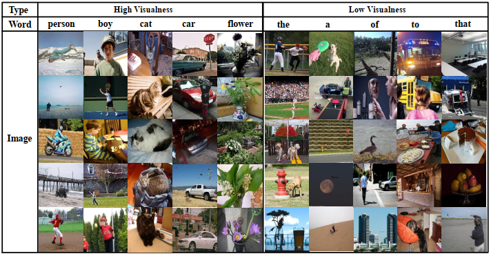

# RSTNet:Relationship-Sensitive Transformer Network
This repository contains the reference code for the paper _RSTNet:Captioning with Adaptive Attention on Visual and Non-Visual Words_ (CVPR 2021).

<p align="center">
  
</p>

## Environment setup
Clone the repository and create the `m2release` conda environment using the `environment.yml` file:
```
conda env create -f environment.yml
conda activate m2release
```

Then download spacy data by executing the following command:
```
python -m spacy download en
```

Note: Python 3.6 is required to run our code. 


## Data preparation
To run the code, annotations and detection features for the COCO dataset are needed. Please download the annotations file [annotations.zip](https://drive.google.com/file/d/1i8mqKFKhqvBr8kEp3DbIh9-9UNAfKGmE/view?usp=sharing) and extract it.

Detection features are computed with the code provided by [1]. To reproduce our result, please download the COCO features file [coco_x101_grid.hdf5](https://drive.google.com/open?id=1MV6dSnqViQfyvgyHrmAT_lLpFbkzp3mx), in which detections of each image are stored under the `<image_id>_features` key. `<image_id>` is the id of each COCO image, without leading zeros, and each value should be a `(N, 2048)` tensor, where `N` is the number of grids. 


## Evaluation
To reproduce the results reported in our paper,   
download the pretrained model file [rstnet.pth](https://drive.google.com/file/d/1naUSnVqXSMIdoiNz_fjqKwh9tXF7x8Nx/view?usp=sharing) and place it in the code folder.

Run `python test.py` using the following arguments:

| Argument | Possible values |
|------|------|
| `--batch_size` | Batch size (default: 10) |
| `--workers` | Number of workers (default: 0) |
| `--features_path` | Path to detection features file |
| `--annotation_folder` | Path to folder with COCO annotations |

#### Expected output
Under `output_logs/`, you may also find the expected output of the evaluation code.


## Training procedure
Run `python train.py` using the following arguments:

| Argument | Possible values |
|------|------|
| `--exp_name` | Experiment name|
| `--batch_size` | Batch size (default: 10) |
| `--workers` | Number of workers (default: 0) |
| `--m` | Number of memory vectors (default: 40) |
| `--head` | Number of heads (default: 8) |
| `--warmup` | Warmup value for learning rate scheduling (default: 10000) |
| `--resume_last` | If used, the training will be resumed from the last checkpoint. |
| `--resume_best` | If used, the training will be resumed from the best checkpoint. |
| `--features_path` | Path to detection features file |
| `--annotation_folder` | Path to folder with COCO annotations |
| `--logs_folder` | Path folder for tensorboard logs (default: "tensorboard_logs")|

For example, to train our rstnet model with the parameters used in our experiments, use
```
python train_transformer.py --exp_name rstnet --batch_size 50 --m 40 --head 8 --features_path /path/to/features --annotation_folder /path/to/annotations
```
to train our BERT-based language model with the parameters used in our experiments, use
```
python train_language.py --exp_name bert_language --batch_size 50 --features_path /path/to/features --annotation_folder /path/to/annotations
```

<p align="center">
  
</p>
